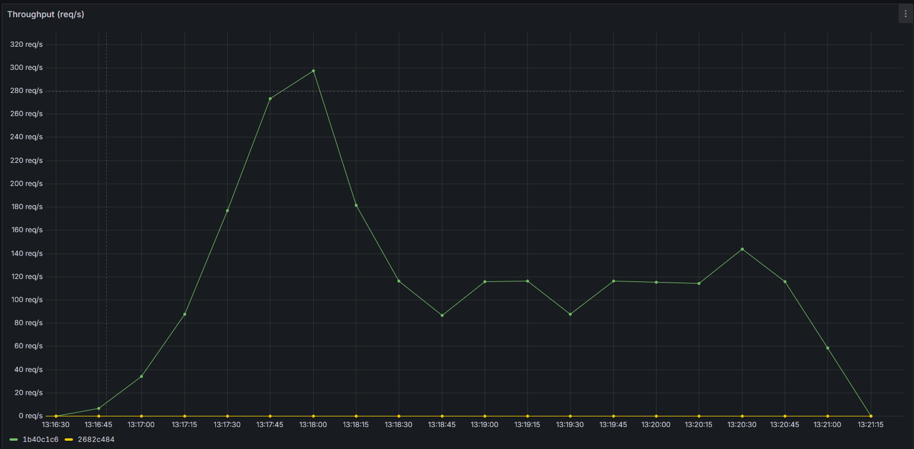
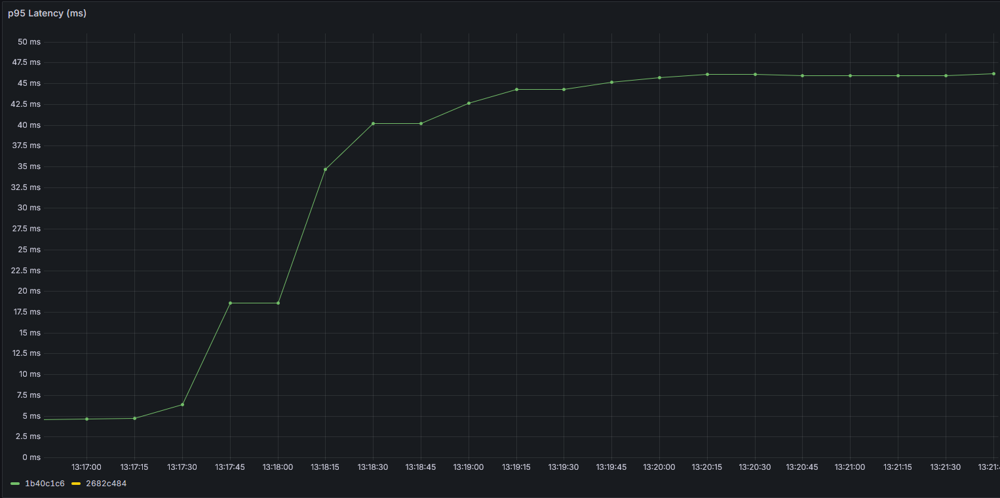

---

# ModelOps Studio: Production-Ready MLOps Service Endpoint


## Why I Built This Project

I built ModelOps Studio to showcase my skills in building production-ready MLOps platforms. I wanted to demonstrate my ability to design, implement, and deploy a complete system that moves a machine learning model from training to production with a focus on reliability, scalability, and automation. This project serves as a tangible proof of my ability to deliver value as a platform engineer.

## Summary

ModelOps Studio is a simplified end-to-end MLOps platform. It allows a user to train a model, deploy it behind an API, show a dashboard with model metrics, and support a canary rollout and basic drift detection. It showcases:

    * A containerized, model serving API built with Python and FastAPI, capable of handling significant load with low latency.

    * An end-to-end model lifecycle management system using MLflow for experiment tracking and a MinIO S3-compatible store for artifact persistence.

    * An observability stack with Prometheus for real-time metric collection and Grafana for dashboarding, all configured declaratively (Infrastructure as Code).

    * An automated canary analysis and rollback system, using live Prometheus metrics to validate model performance before promotion.

    * A multi-stage CI pipeline with GitHub Actions that automates linting, unit testing, and Docker builds to create a robust quality gate.

    * Validated performance, proving the system can handle over 140 requests/second with a P95 latency under 200ms in a local environment.

---

## Technical Architecture & Core Components

This microservices architecture is fully containerized using Docker Compose for local development, mirroring production deployment standards.

| Service        | What it does                                                                                                      |
| -------------- | ----------------------------------------------------------------------------------------------------------------- |
| `minio`        | S3-compatible artifact store. MLflow stores model artifacts here. `.env` stores `MINIO_ROOT_USER/PASSWORD`.       |
| `mc-setup`     | One-off container that uses `mc` to ensure the MLflow S3 bucket exists in MinIO.                                  |
| `mlflow`       | MLflow tracking server. UI at `port 5000`.                                                                        |
| `redis`        | Lightweight online store used for canary flags / simple state.                                                    |
| `trainer`      | Training job that logs runs to MLflow (can be run inside the container or locally).                               |
| `model-server` | FastAPI app that loads MLflow models and exposes `/predict`, `/deploy`, and `/metrics`. This is the core runtime. |
| `prometheus`   | Scrapes `/metrics` from the model-server and other sources.                                                       |
| `grafana`      | Dashboarding. Provisioned with `infra/grafana` files. UI at `port 3000` (admin/admin).                            |
| `frontend-dev` | A one-off container for performance testing. Uses grafana/k6 to run the load test script.                         |
| `k6`           | Basic React UI (port 5173) that calls the model-server API for demo flows.                                        |

### Repository Structure

.github/workflows/ci.yml: The GitHub Actions pipeline that runs on every push and pull request. It executes fast unit tests automatically and enables manual dispatch for the full integration test suite, which builds and validates the entire Docker stack.

infra/: Contains all Infrastructure-as-Code for third-party services (Grafana dashboards, Prometheus configuration).

scripts/: Houses a key orchestration script that automates the entire integration testing lifecycle: building the stack, health-checking the API, running tests against live services, and tearing down the environment.

services/: Source code for the application's microservices (model_server, trainer).

tests/: The automated testing suite, separated into unit and integration tests.

tools/: Contains scripts for advanced interactions like k6 load testing and canary analysis.

web/: Source code for the React + Vite frontend.

docker-compose.yml: The single command entrypoint for orchestrating all services locally.

.env.example: A template file defining all necessary environment variables.

requirements.txt: Clean, pinned, and OS-agnostic Python dependency management using pip-tools.

---

## Performance & Reliability Metrics

To validate the production readiness of the model server, a performance test was executed using a multi-stage `k6` load test, simulating peak user concurrency.

| Metric | Measured Value | Professional Significance |
| :--- | :--- | :--- |
| **Peak Throughput** | **~300 req/s** | Demonstrates high-volume processing capacity. |
| **Average Sustained Throughput** | **146 req/s** | Reliable long-term serving capacity. |
| **P95 Latency** | **171.81 ms** | **95% of all requests** completed quickly. |
| **Error Rate** | **0.00%** | The system handled over 36,000 requests without a single API failure. |

*(Note: Benchmarks run on standard development hardware (Windows) with Docker Compose.)*

### Live Observability Proof (Grafana Screenshots)

**Throughput (Requests per Second):**


**p95 Latency (milliseconds):**


---

## Getting Started (Run It Locally)

### Prerequisites

You must have [Docker Desktop](https://www.docker.com/products/docker-desktop) (which includes Docker Compose) and Git installed.

### Execution

1.  **Clone the repository:**
    ```bash
    git clone https://github.com/Joao-Gabriel-Santos00/modelops-studio.git
    cd modelops-studio
    ```

2.  **Initialize Environment (One-time Setup):**
    This copies the template for secrets. The values are automatically configured for local testing.

    ```bash
    cp .env.example .env
    ```

3.  **Launch the Full Stack:**
    Run this command from the root of the project. It handles building images, installing dependencies, and creating the MinIO bucket automatically.

    ```bash
    docker-compose up --build -d
    ```

### Access Points

| Service | Address | Credentials (for Admin UI) | Notes |
| :--- | :--- | :--- | :--- |
| **Frontend UI** | `http://localhost:5173` | N/A | Dashboard view |
| **MLflow UI** | `http://localhost:5000` | N/A | View experiments and runs |
| **Grafana Dashboard** | `http://localhost:3000` | admin / admin | View real-time metrics |
| **Model API** | `http://localhost:8000/docs` | N/A | FastAPI Swagger Docs |

### Running Integration Tests

This script automates the entire testing lifecycle: starting the stack, waiting for services to be healthy, running tests, and tearing everything down.

# Ensure the script is executable (one-time command)
chmod +x ./scripts/run_integration.sh

# Run the full integration test suite
./scripts/run_integration.sh

### Running a Canary Analysis

This command orchestrates a full canary test: deploying a new model, generating a test load, and evaluating its performance against a baseline using live Prometheus metrics.

Prerequisite: The main application stack must be running (docker-compose up -d).

# Ensure the script is executable (one-time command)
chmod +x ./scripts/run_canary_analysis.sh

# Example: Test a new model and automatically revert to baseline on failure
./scripts/run_canary_analysis.sh \
  --run-id <YOUR_NEW_CANARY_RUN_ID> \
  --baseline-run-id <YOUR_STABLE_BASELINE_RUN_ID> \
  --requests 500 \
  --revert

*(Note: You can get Run IDs from the MLflow UI at http://localhost:5000)*

### Running the Load Test

This command uses k6 to execute a multi-stage stress test against the /predict endpoint to generate performance metrics.

Prerequisite: The main application stack must be running (docker-compose up -d).

# Run the load test
docker-compose run --rm k6

---

## Next Steps & Future Work

To further advance this project toward a true production system, the following areas would be tackled:

*   **Orchestration Layer:** Integrate the `trainer` service into an Apache Airflow or Dagster pipeline, replacing the current manual trigger with an automated DAG based on a daily schedule or data drift sensor.
*   **Scalability Proof:** Refactor the `docker-compose.yml` into Helm Charts and deploy the service onto a local `Minikube` or `k3s` cluster.
*   **Cloud Migration:** Replace MinIO and local Docker networking with fully managed cloud services (AWS S3 and an ECS/EKS cluster).